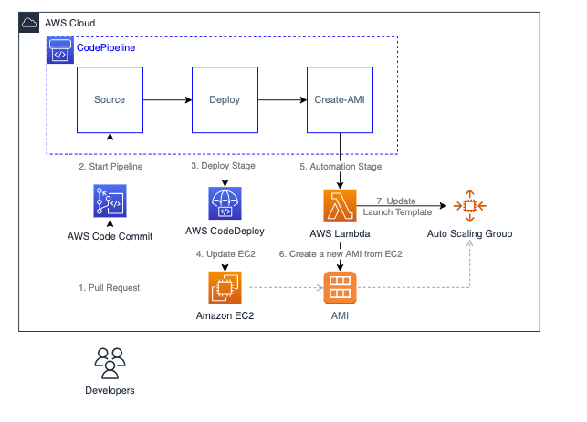

## Automating the creation of AMIs and the update of an Auto Scaling group using a CI/CD Pipeline 

Code used on this [tutorial](https://aws.amazon.com/blogs/?awsf.blog-master-category=*all&awsf.blog-master-learning-levels=*all&awsf.blog-master-industry=*all&awsf.blog-master-analytics-products=*all&awsf.blog-master-artificial-intelligence=*all&awsf.blog-master-aws-cloud-financial-management=*all&awsf.blog-master-blockchain=*all&awsf.blog-master-business-applications=*all&awsf.blog-master-compute=*all&awsf.blog-master-customer-enablement=*all&awsf.blog-master-customer-engagement=*all&awsf.blog-master-database=*all&awsf.blog-master-developer-tools=*all&awsf.blog-master-devops=*all&awsf.blog-master-end-user-computing=*all&awsf.blog-master-mobile=*all&awsf.blog-master-iot=*all&awsf.blog-master-management-governance=*all&awsf.blog-master-media-services=*all&awsf.blog-master-migration-transfer=*all&awsf.blog-master-migration-solutions=*all&awsf.blog-master-networking-content-delivery=*all&awsf.blog-master-programming-language=*all&awsf.blog-master-sector=*all&awsf.blog-master-security=*all&awsf.blog-master-storage=*all "AWS Blog").

The code is used for a CI/CD pipeline which updates an auto scaling group of EC2 instances and creates an AMI of this instances. Than a new launch template version is created with this AMI.

The [appspec.yml](appspec.yml) file is used by the CodeDeploy agent, to deploy the changes to the EC2 instances.

The [scripts](/scripts/) folder holds the shell scripts used by the CodeDeploy agent to deploy the application.

The [index.php](/index.php) file is our demo, you can change the text to test the application.

The [LambdaCode.py](/LambdaCode.py) is the code used by the Lambda function to create a new AMI and update the launch configuration.
To use it on a Lambda function you will need to set the timeout to 5 seconds and input the enviroment variables:

|Name|Stands For|
|----|-----|
|Auto_Scailing_Group_Name|Name of the Auto Scaling group that is going to be updated|
|EC2_Role_ARN|Instance Profile ARN of the IAM Role for the EC2|
|EC2_Security_Group_ID|Security Group's ID for the EC2 instances|
|Launch_Template_Name|Name of the Launch Tamplate that is used by the Auto Scailing group|
|Private_Key_Name|Name of the Private Key used to acess your EC2 instances|

## Security

See [CONTRIBUTING](CONTRIBUTING.md#security-issue-notifications) for more information.

## License

This library is licensed under the MIT-0 License. See the LICENSE file.

